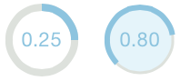

# FSCoronaKnob #

## Corona Knob Control for iOS ##

This knob is a circular control with a colored corona that represents its value. It supports 
both tap and drag gestures to change its value. An optional delegate object allows for 
customized labels to display the value in the middle of the knob as well as setting the 
corona's color dynamically. 

Requires iOS SDK 7.0+ and ARC. 

See example app within project for usage.

---

Copyright (C) 2014  Flyingsand

This program is free software: you can redistribute it and/or modify it under the terms 
of the GNU General Public License as published by the Free Software Foundation, either 
version 3 of the License, or (at your option) any later version.

This program is distributed in the hope that it will be useful, but WITHOUT ANY WARRANTY; 
without even the implied warranty of MERCHANTABILITY or FITNESS FOR A PARTICULAR PURPOSE.  
See the  GNU General Public License for more details.

You should have received a copy of the GNU General Public License along with this program.  
If not, see <http://www.gnu.org/licenses/>.
